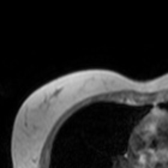

## Wrong Prediction from GPT-4o
The organ on the left side of this MRI image is the heart.


## Correct Prediction from OctoTools

### Step 0: Initial Plan from Query Analyzer
**Required skills:**

1. Image Analysis: Ability to interpret and analyze medical images to identify organs.
2. Medical Knowledge: Understanding of human anatomy to accurately identify organs in medical images.

**Relevant tools:**

1. `Image_Captioner_Tool`: This tool can generate a description of the image, which might help in identifying the organ on the left side. However, it may have limitations in complex medical images.
2. `Relevant_Patch_Zoomer_Tool`: This tool can zoom into specific areas of the image, which might help in focusing on the left side to better identify the organ.

### Step 1: Action from Action Predictor

**Justification:**
The `Relevant_Patch_Zoomer_Tool` is the best choice for the next step because it allows us to focus specifically on the left side of the image, which is where the organ in question is located...

**Context:**
Image path: source.jpg

**Sub-goal:**
Zoom into the left side of the image to focus on the organ located there...

**Tool name:**
`Relevant_Patch_Zoomer_Tool`

### Step 1: Command from Command Generator

**Command:**

```python
execution = tool.execute(image="source.jpg", question="What is the organ on the left side of the image?")
```

### Step 1: Result from Command Executor
**Analysis:**
The image appears to be a cross-sectional scan, likely an MRI or CT scan, of the thoracic region.

- (A) Top-left quarter: This region shows part of the thoracic cavity, likely including lung tissue and possibly part of the heart or other structures.
...

To identify the organ on the left side of the image, the most relevant region is (A) Top-left quarter, as it contains the left side of the thoracic cavity.

**Zoomed-in Patch:**

`source_top-left_zoomed_2x.png`




### Step 1: Verification from Context Verifier

**Ambiguities:**
The result is ambiguous as it does not clearly identify the organ. Using the `Image_Captioner_Tool` could help clarify this.

**Final determination:**
Given these points, additional tool usage is necessary to accurately identify the organ on the left side of the image.

**Conclusion:** `CONTINUE`

### Step 2: Action from Action Predictor

**Justification:**
The `Image_Captioner_Tool` is the best choice for the next step because it can generate a detailed description of the zoomed-in image patch, which is focused on the left side of the thoracic cavity.

**Tool name:** `Image_Captioner_Tool`


### Step 2: Command from Command Generator

**Command:**

```python
execution = tool.execute(image="source_top-left_zoomed_2x.png")
```

### Step 2: Result from Command Executor

**Result:** The image shows a cross-sectional view of the human brain, likely from an MRI scan.

### Step 2: Verification from Context Verifier

**Final determination:**
There is a clear inconsistency between the initial analysis (suggesting a thoracic region) and the `Image_Captioner_Tool`'s result (identifying the brain). This needs resolution to ensure accurate identification of the organ.
The memory is insufficient due to the inconsistency in organ identification. Additional tool usage, specifically the `Generalist_Solution_Generator_Tool`, is necessary to resolve the ambiguity and verify the organ's identity.

**Conclusion:** `CONTINUE`

### Step 3: Action from Action Predictor

**Justification:**
The `Image_Captioner_Tool` has already been used to generate a description of the zoomed-in image patch, which identified the organ as part of the brain. To ensure accuracy and specificity, it is important to verify this result with a medical expert. Since the `Generalist_Solution_Generator_Tool` can provide a step-by-step reasoning and potentially refine the understanding of the image content, it is suitable for generating a more detailed analysis or hypothesis about the organ based on the current findings. This tool can help bridge the gap between the image analysis and medical knowledge required to accurately identify the organ.

**Tool name:** `Generalist_Solution_Generator_Tool`


### Step 3: Command from Command Generator

**Command:**

```python
execution = tool.execute(prompt="Analyze the image and determine the organ on the left side, considering it is a cross-sectional view of the human brain.", image="source.jpg")
```

### Step 3: Result from Command Executor
**Result:** The image provided is not a cross-sectional view of the human brain. It appears to be a cross-sectional MRI of the thorax, showing the chest area. The organs visible in this image are likely the lungs and the heart, not brain structures.

### Step 3: Verification from Context Verifier

**Ambiguities:**
The ambiguity arises from the `Image_Captioner_Tool`'s incorrect description. The `Generalist_Solution_Generator_Tool` provides a more accurate context.

**Final determination:**
The memory is mostly sufficient, but due to the initial misidentification, manual verification by a medical expert is recommended to ensure accuracy. No additional tool usage is necessary, as the `Generalist_Solution_Generator_Tool` has provided a plausible correction.


**Conclusion:** `STOP`

### Final Answer

The image is a cross-sectional MRI of the thorax. In this orientation, the **left side** of the image represents the right side of the patient due to standard medical imaging conventions. The organ on the left side of the image is likely the right lung.

